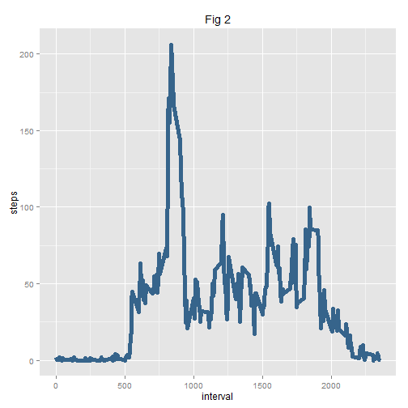

***

#Introduction  

*****
  
This report makes use of data from a personal activity monitoring device. This device collects data at 5 minute intervals through out the day.    
The data consists of two months of data from an anonymous individual collected during the months of October and November, 2012 and include the number of steps taken in 5 minute intervals each day.  

*****

#Data 


The dataset can be downloaded from the course website:

- **Dataset** : [Activity Monitoring Data](https://d396qusza40orc.cloudfront.net/repdata%2Fdata%2Factivity.zip)[52K]

It is stored in a **comma-separated_value (CSV)** file.  

There are **17568 observations** of **3 variables**:  

- **steps** : Number of steps taking in a 5-min interval ; missing values are noted as "NA"
- **date** : The date on which the measurement was taken in YYYY-MM-DD format
- **interval** : Identifier for the 5-minute interval in which measurement was taken

*****

#Loading the dataset

***
The data is in a .zip file format and has to be extracted in the working directory.    
Then, the data can be read using the read.csv() function in R :


```r
activity<-read.csv("C:/Users/Sarah/Desktop/Data Science/Reproducible Research/CourseProject1/RepData_PeerAssessment1/activity.csv")
```

Here are the first few rows :


```r
head(activity)
```

```
##   steps       date interval
## 1    NA 2012-10-01        0
## 2    NA 2012-10-01        5
## 3    NA 2012-10-01       10
## 4    NA 2012-10-01       15
## 5    NA 2012-10-01       20
## 6    NA 2012-10-01       25
```

*****

#Average total number of steps taken per day

***

####1. Histogram of the total number of steps taken each day

In the following part, the missing values will be ignored. We will first compute a summary of the total number of steps taken each day and then make an histogram of the results (**Fig 1**)


```r
## Computes a summary of the total number of steps taken each day
by_day <- aggregate(steps ~ date, data = activity, sum)

## Plot using ggplot2
library(ggplot2)
ggplot(by_day, aes(steps)) + geom_histogram(fill = "steelblue2", colour = "steelblue4", 
    breaks = c(0, 5000, 10000, 15000, 20000, 25000)) + labs(y = expression("frequency")) + 
    labs(x = expression("number of steps per day")) + labs(title = expression("Fig 1"))
```

 

The histogram seems to be bell-shaped with most of the values concentrated between 10,000 and 15,000 steps per day.

***

####2. Mean and median total number of steps taken per day  

Calculate the mean and median of total number of steps taken per day:


```r
## Mean 
mean1<-mean(by_day$steps)
mean1
```

[1] 10766.19

```r
## Median 
median1<-median(by_day$steps)
median1
```

[1] 10765
The mean and median are respectively 10766 and 10765 steps taken per day. 
The results confirm the bell-shaped distribution of the total number of steps taken per day. Indeed, median and mean are approximately equal and between 10,000 and 15,000 steps per day.

*****

#Average daily activity pattern

***

####1. Time series plot of the 5-minute interval and the average number of steps taken, averaged across all days 

In this part, we will be focusing on the number of steps taken in each specific 5-minute interval and again, missing values will be ignored.  
The same strategy as before will be operated, computing a summary (in this case by mean) in each interval first before plotting the results.(**Fig 2**)

```r
## Computes a summary of the average by 5mn-interval across all days
by_interval <- aggregate(steps ~ interval, data = activity, FUN = function(x) {
    mean(x, na.rm = TRUE)
})

## Time series plot
ggplot(by_interval, aes(interval, steps)) + geom_line(colour = "steelblue4", 
    lwd = 2) + labs(title = expression("Fig 2"))
```

 

The plot shows a peek around the 800th interval.

***

####2. Maximum 5-minutes interval    

Evaluate the maximum 5-minute interval:

```r
## Maximum interval
by_interval$interval[which.max(by_interval$steps)]
```

[1] 835

The peak is attained for the 835th interval.  


```r
## Maximum value
max(by_interval$steps)
```

[1] 206.1698
The peak is 206 steps.

*****

#Imputing missing values

***
This part of the report is devoted to filling in the missing values in the dataset.

####1. Calculate the total number of missing values


```r
na<-sum(is.na(activity))
rate<-paste(round(100*(na/nrow(activity)), 3), "%")
```

There are 2304 missing values in this dataset, which represent 13% of the total number of values.

***

####2. Filling in the missing values using the mean of the specific 5-minutes interval

As a strategy for filling in the missing values in the dataset, we will be using the mean of the specific 5-minute interval in which the observation is missing.  


```r
for (i in 1:length(activity$steps)) {
    if (is.na(activity[i, 1])) {
        
        ## Corresponding 5-minute interval, computed before
        steps_average <- subset(by_interval, by_interval$interval == as.numeric(activity[i, 
            3]))$steps
        
        ## Replaces the value
        activity[i, 1] <- steps_average
    } else {
        activity[i, 1] <- activity[i, 1]
    }
    activity
}
```

***

####3. New dataset with the missing values filled in

Here are the first and last few rows :


```r
head(activity)
```

```
##       steps       date interval
## 1 1.7169811 2012-10-01        0
## 2 0.3396226 2012-10-01        5
## 3 0.1320755 2012-10-01       10
## 4 0.1509434 2012-10-01       15
## 5 0.0754717 2012-10-01       20
## 6 2.0943396 2012-10-01       25
```

```r
tail(activity)
```

```
##           steps       date interval
## 17563 2.6037736 2012-11-30     2330
## 17564 4.6981132 2012-11-30     2335
## 17565 3.3018868 2012-11-30     2340
## 17566 0.6415094 2012-11-30     2345
## 17567 0.2264151 2012-11-30     2350
## 17568 1.0754717 2012-11-30     2355
```

***

####4. Histogram of the total number of steps taken each day - Mean and median of the total number of steps taken per day - Impact of the missing value imputing strategy

* Histogram of total number of steps taken per day (**Fig 3**)


```r
by_date <- aggregate(steps ~ date, data = activity, sum)

library(ggplot2)
ggplot(by_date, aes(steps)) + geom_histogram(fill = "steelblue2", colour = "steelblue4", 
    breaks = c(0, 5000, 10000, 15000, 20000, 25000)) + labs(y = expression("frequency")) + 
    labs(x = expression("number of steps per day")) + labs(title = expression("Fig 3"))
```

 

The distribution doesn't seem to have changed with the values filled in.

***

* Mean and median of the total number of steps taken per day


```r
mean2<-mean(by_date$steps)
mean2
```

[1] 10766.19

```r
median2<-median(by_date$steps)
median2
```

[1] 10766.19
The mean is 10766 and median 10766 steps taken per day. 

***

* Differences between the first and the second sets of estimates


```r
## Variation of the mean due to the missing value imputing strategy in percent
delta_mean<-(mean1-mean2)/mean1
paste(round(100*delta_mean, 4), "%")
```

[1] "0 %"

```r
## Variation of the mean due to the missing value imputing strategy in percent
delta_median<-(median1-median2)/median1
paste(round(100*delta_median, 4), "%")
```

[1] "-0.011 %"

The variation of the mean and the median after imputing the missing values are respectively 0% and -0.011%. The difference between is small for this sample.

*****

#Differences in activity patterns between weekdays and weekends

***

####1. Create a new factor variable in the dataset with two levels - "weekday" and "weekend" indicating whether a given date is a weekday or weekend day.


```r
## Converts the variable 'date' to POSIXct class
activity$date <- strptime(activity$date, "%Y-%m-%d")

library(dplyr)

## Creates a new column with days of the week
activity <- mutate(activity, day = weekdays(date))

## Creates a factor variable with 2 levels
for (i in 1:length(activity$day)) {
    if (activity[i, 4] == "samedi") {
        activity[i, 4] <- "weekend"
        
    } else {
        activity[i, 4] <- "weekday"
        
    }
}
activity$day <- as.factor(activity$day)
```


Here are the first few rows of the dataset with the new factor variable:


```r
head(activity)
```

```
##       steps       date interval     day
## 1 1.7169811 2012-10-01        0 weekday
## 2 0.3396226 2012-10-01        5 weekday
## 3 0.1320755 2012-10-01       10 weekday
## 4 0.1509434 2012-10-01       15 weekday
## 5 0.0754717 2012-10-01       20 weekday
## 6 2.0943396 2012-10-01       25 weekday
```

***

####2. Panel plot containing a time series plot of the 5-minute interval and the average number of steps taken, averaged across all weekday days or weekend days.(**Fig 4**)


```r
## Computes a summary of the average number of steps taken across all weekday
## days and weekend days
summary <- aggregate(activity$steps, list(interval = activity$interval, day = activity$day), 
    mean)
names(summary) <- c("interval", "day", "steps")

## Plot using ggplot2
ggplot(summary, aes(interval, steps)) + geom_line(color = "steelblue4", lwd = 2) + 
    facet_wrap(~day, ncol = 1) + labs(title = expression("Fig 4"))
```

 

There is a more activity during week-end time.  

***

